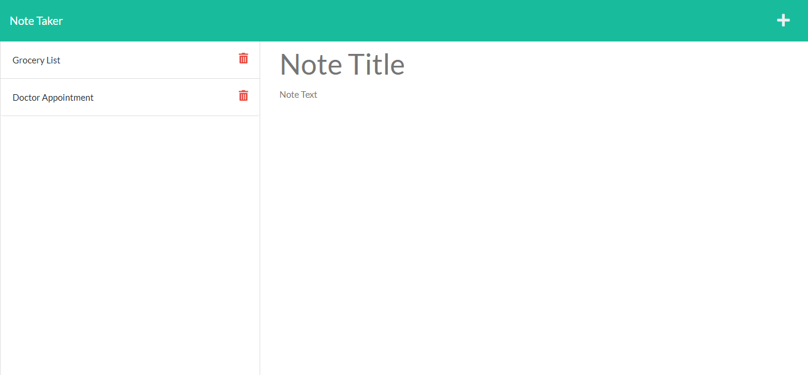

# Note Taker

## Description
This project is a note taker that can be used to write and save notes. This application uses an Express.js back end and saves, retrieves, and deletes note data from a JSON file.

## Deployed Link
The live app can be accessed at [https://infinite-temple-52670.herokuapp.com/](https://infinite-temple-52670.herokuapp.com/).

## Screenshot

## Questions
If you have questions about this repo, open an issue or contact me directly at todd@theharveysplace.com. You can find more of my work at [tharveyster](https://github.com/tharveyster).

## License
ISC